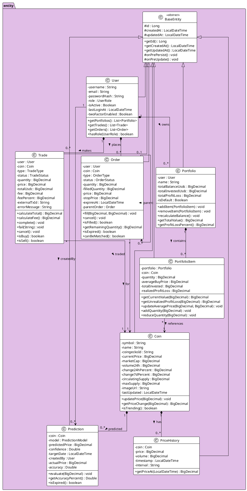

```plantuml
@startuml Entities
!theme plain
skinparam classAttributeIconSize 0
skinparam linetype ortho

package "entity" #E1BEE7 {
  
  class BaseEntity <<abstract>> {
    # id : Long
    # createdAt : LocalDateTime
    # updatedAt : LocalDateTime
    --
    + getId() : Long
    + getCreatedAt() : LocalDateTime
    + getUpdatedAt() : LocalDateTime
    # onPrePersist() : void
    # onPreUpdate() : void
  }
  
  class User {
    - username : String
    - email : String
    - passwordHash : String
    - role : UserRole
    - isActive : Boolean
    - lastLoginAt : LocalDateTime
    - twoFactorEnabled : Boolean
    --
    + getPortfolios() : List<Portfolio>
    + getTrades() : List<Trade>
    + getOrders() : List<Order>
    + hasRole(UserRole) : boolean
  }
  
  class Portfolio {
    - user : User
    - name : String
    - totalBalanceUsdc : BigDecimal
    - totalInvestedUsdc : BigDecimal
    - totalProfitLoss : BigDecimal
    - isDefault : Boolean
    --
    + addItem(PortfolioItem) : void
    + removeItem(PortfolioItem) : void
    + recalculateBalance() : void
    + getTotalValue() : BigDecimal
    + getProfitLossPercent() : BigDecimal
  }
  
  class PortfolioItem {
    - portfolio : Portfolio
    - coin : Coin
    - quantity : BigDecimal
    - averageBuyPrice : BigDecimal
    - totalInvested : BigDecimal
    - realizedProfitLoss : BigDecimal
    --
    + getCurrentValue(BigDecimal) : BigDecimal
    + getUnrealizedProfitLoss(BigDecimal) : BigDecimal
    + updateAveragePrice(BigDecimal, BigDecimal) : void
    + addQuantity(BigDecimal) : void
    + reduceQuantity(BigDecimal) : void
  }
  
  class Coin {
    - symbol : String
    - name : String
    - coingeckoId : String
    - currentPrice : BigDecimal
    - marketCap : BigDecimal
    - volume24h : BigDecimal
    - change24hPercent : BigDecimal
    - change7dPercent : BigDecimal
    - circulatingSupply : BigDecimal
    - maxSupply : BigDecimal
    - imageUrl : String
    - lastUpdated : LocalDateTime
    --
    + updatePrice(BigDecimal) : void
    + getPriceChange(BigDecimal) : BigDecimal
    + isTrending() : boolean
  }
  
  class Trade {
    - user : User
    - coin : Coin
    - type : TradeType
    - status : TradeStatus
    - quantity : BigDecimal
    - price : BigDecimal
    - totalUsdc : BigDecimal
    - fee : BigDecimal
    - feePercent : BigDecimal
    - externalTxId : String
    - errorMessage : String
    --
    + calculateTotal() : BigDecimal
    + calculateFee() : BigDecimal
    + complete() : void
    + fail(String) : void
    + cancel() : void
    + isBuy() : boolean
    + isSell() : boolean
  }
  
  class Order {
    - user : User
    - coin : Coin
    - type : OrderType
    - status : OrderStatus
    - quantity : BigDecimal
    - filledQuantity : BigDecimal
    - price : BigDecimal
    - stopPrice : BigDecimal
    - expiresAt : LocalDateTime
    - parentOrder : Order
    --
    + fill(BigDecimal, BigDecimal) : void
    + cancel() : void
    + isFilled() : boolean
    + getRemainingQuantity() : BigDecimal
    + isExpired() : boolean
    + canBeMatched() : boolean
  }
  
  class PriceHistory {
    - coin : Coin
    - price : BigDecimal
    - volume : BigDecimal
    - timestamp : LocalDateTime
    - interval : String
    --
    + getPriceAt(LocalDateTime) : BigDecimal
  }
  
  class Prediction {
    - coin : Coin
    - model : PredictionModel
    - predictedPrice : BigDecimal
    - confidence : Double
    - targetDate : LocalDateTime
    - createdBy : User
    - actualPrice : BigDecimal
    - accuracy : Double
    --
    + evaluate(BigDecimal) : void
    + getAccuracyPercent() : Double
    + isExpired() : boolean
  }
}

' Наследование
BaseEntity <|-- User
BaseEntity <|-- Portfolio
BaseEntity <|-- PortfolioItem
BaseEntity <|-- Coin
BaseEntity <|-- Trade
BaseEntity <|-- Order
BaseEntity <|-- PriceHistory
BaseEntity <|-- Prediction

' Ассоциации
User "1" *-- "0..*" Portfolio : owns >
Portfolio "1" *-- "0..*" PortfolioItem : contains >
PortfolioItem "*" --> "1" Coin : references >
User "1" *-- "0..*" Trade : makes >
Trade "*" --> "1" Coin : traded >
User "1" *-- "0..*" Order : places >
Order "*" --> "1" Coin : for >
Order "0..1" --> "0..*" Order : parent >
Coin "1" *-- "0..*" PriceHistory : has >
Coin "1" *-- "0..*" Prediction : predicted >
User "1" --> "0..*" Prediction : createdBy >

@enduml
```
