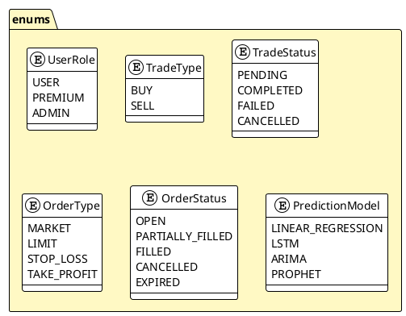

```plantuml
@startuml Enums
!theme plain
skinparam classAttributeIconSize 0

package "enums" #FFF9C4 {
  enum UserRole {
    USER
    PREMIUM
    ADMIN
  }
  
  enum TradeType {
    BUY
    SELL
  }
  
  enum TradeStatus {
    PENDING
    COMPLETED
    FAILED
    CANCELLED
  }
  
  enum OrderType {
    MARKET
    LIMIT
    STOP_LOSS
    TAKE_PROFIT
  }
  
  enum OrderStatus {
    OPEN
    PARTIALLY_FILLED
    FILLED
    CANCELLED
    EXPIRED
  }
  
  enum PredictionModel {
    LINEAR_REGRESSION
    LSTM
    ARIMA
    PROPHET
  }
}
@enduml
```
