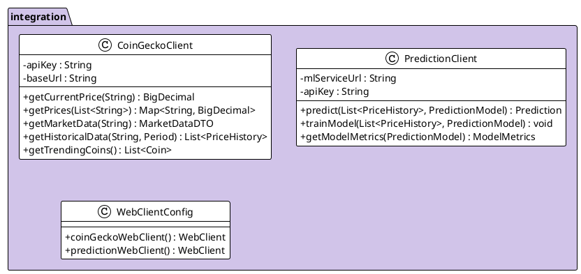

```plantuml
@startuml Integrations
!theme plain
skinparam classAttributeIconSize 0

package "integration" #D1C4E9 {
  
  class CoinGeckoClient {
    - apiKey : String
    - baseUrl : String
    --
    + getCurrentPrice(String) : BigDecimal
    + getPrices(List<String>) : Map<String, BigDecimal>
    + getMarketData(String) : MarketDataDTO
    + getHistoricalData(String, Period) : List<PriceHistory>
    + getTrendingCoins() : List<Coin>
  }
  
  class PredictionClient {
    - mlServiceUrl : String
    - apiKey : String
    --
    + predict(List<PriceHistory>, PredictionModel) : Prediction
    + trainModel(List<PriceHistory>, PredictionModel) : void
    + getModelMetrics(PredictionModel) : ModelMetrics
  }
  
  class WebClientConfig {
    --
    + coinGeckoWebClient() : WebClient
    + predictionWebClient() : WebClient
  }
}

@enduml
```
