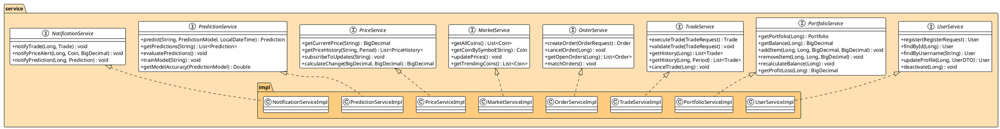

```plantuml
@startuml Services
!theme plain
skinparam classAttributeIconSize 0

package "service" #FFE0B2 {
  interface UserService {
    + register(RegisterRequest) : User
    + findById(Long) : User
    + findByUsername(String) : User
    + updateProfile(Long, UserDTO) : User
    + deactivate(Long) : void
  }
  
  interface PortfolioService {
    + getPortfolio(Long) : Portfolio
    + getBalance(Long) : BigDecimal
    + addItem(Long, Long, BigDecimal, BigDecimal) : void
    + removeItem(Long, Long, BigDecimal) : void
    + recalculateBalance(Long) : void
    + getProfitLoss(Long) : BigDecimal
  }
  
  interface TradeService {
    + executeTrade(TradeRequest) : Trade
    + validateTrade(TradeRequest) : void
    + getHistory(Long) : List<Trade>
    + getHistory(Long, Period) : List<Trade>
    + cancelTrade(Long) : void
  }
  
  interface OrderService {
    + createOrder(OrderRequest) : Order
    + cancelOrder(Long) : void
    + getOpenOrders(Long) : List<Order>
    + matchOrders() : void
  }
  
  interface MarketService {
    + getAllCoins() : List<Coin>
    + getCoinBySymbol(String) : Coin
    + updatePrices() : void
    + getTrendingCoins() : List<Coin>
  }
  
  interface PriceService {
    + getCurrentPrice(String) : BigDecimal
    + getPriceHistory(String, Period) : List<PriceHistory>
    + subscribeToUpdates(String) : void
    + calculateChange(BigDecimal, BigDecimal) : BigDecimal
  }
  
  interface PredictionService {
    + predict(String, PredictionModel, LocalDateTime) : Prediction
    + getPredictions(String) : List<Prediction>
    + evaluatePredictions() : void
    + trainModel(String) : void
    + getModelAccuracy(PredictionModel) : Double
  }
  
  interface NotificationService {
    + notifyTrade(Long, Trade) : void
    + notifyPriceAlert(Long, Coin, BigDecimal) : void
    + notifyPrediction(Long, Prediction) : void
  }
}

package "service.impl" #FFCC80 {
  class UserServiceImpl
  class PortfolioServiceImpl
  class TradeServiceImpl
  class OrderServiceImpl
  class MarketServiceImpl
  class PriceServiceImpl
  class PredictionServiceImpl
  class NotificationServiceImpl
}

UserService <|.. UserServiceImpl
PortfolioService <|.. PortfolioServiceImpl
TradeService <|.. TradeServiceImpl
OrderService <|.. OrderServiceImpl
MarketService <|.. MarketServiceImpl
PriceService <|.. PriceServiceImpl
PredictionService <|.. PredictionServiceImpl
NotificationService <|.. NotificationServiceImpl

@enduml
```
