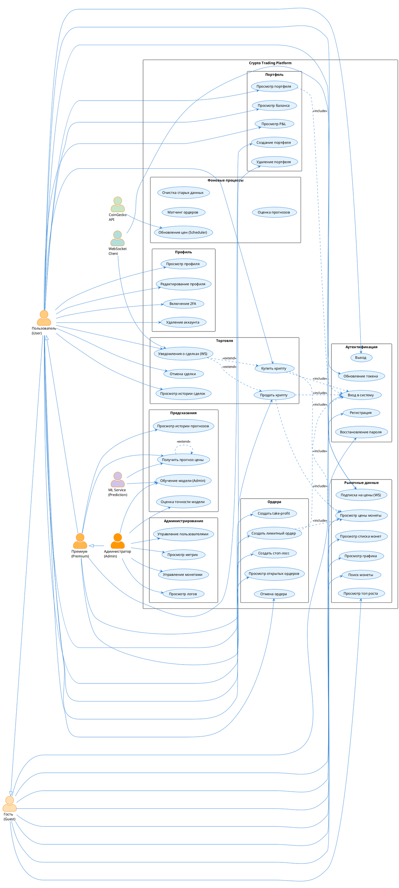

```plantuml
@startuml Use Case Diagram
!theme plain
skinparam actorStyle awesome
skinparam usecase {
  BackgroundColor #E3F2FD
  BorderColor #1976D2
  ArrowColor #1976D2
}
skinparam actor {
  BackgroundColor #FFF3E0
  BorderColor #F57C00
}
skinparam packageStyle rectangle

' ============================================
' АКТОРЫ (слева - основные, справа - второстепенные)
' ============================================
left to right direction

actor "Гость\n(Guest)" as Guest #FFE0B2
actor "Пользователь\n(User)" as User #FFCC80
actor "Премиум\n(Premium)" as Premium #FFB74D
actor "Администратор\n(Admin)" as Admin #FF9800

actor "CoinGecko\nAPI" as CoinGecko #C8E6C9
actor "ML Service\n(Prediction)" as ML #D1C4E9
actor "WebSocket\nClient" as WS #B2DFDB

' ============================================
' СИСТЕМА
' ============================================
rectangle "Crypto Trading Platform" {

  ' ---- Аутентификация ----
  package "Аутентификация" {
    usecase "Регистрация" as UC_Register
    usecase "Вход в систему" as UC_Login
    usecase "Выход" as UC_Logout
    usecase "Обновление токена" as UC_Refresh
    usecase "Восстановление пароля" as UC_ResetPassword
  }

  ' ---- Профиль ----
  package "Профиль" {
    usecase "Просмотр профиля" as UC_ViewProfile
    usecase "Редактирование профиля" as UC_EditProfile
    usecase "Включение 2FA" as UC_2FA
    usecase "Удаление аккаунта" as UC_DeleteAccount
  }

  ' ---- Рыночные данные ----
  package "Рыночные данные" {
    usecase "Просмотр списка монет" as UC_ViewCoins
    usecase "Просмотр цены монеты" as UC_ViewPrice
    usecase "Просмотр графика" as UC_ViewChart
    usecase "Поиск монеты" as UC_SearchCoin
    usecase "Просмотр топ роста" as UC_Trending
    usecase "Подписка на цены (WS)" as UC_SubscribePrice
  }

  ' ---- Портфель ----
  package "Портфель" {
    usecase "Просмотр портфеля" as UC_ViewPortfolio
    usecase "Просмотр баланса" as UC_ViewBalance
    usecase "Просмотр P&L" as UC_ViewPnL
    usecase "Создание портфеля" as UC_CreatePortfolio
    usecase "Удаление портфеля" as UC_DeletePortfolio
  }

  ' ---- Торговля ----
  package "Торговля" {
    usecase "Купить крипту" as UC_Buy
    usecase "Продать крипту" as UC_Sell
    usecase "Просмотр истории сделок" as UC_TradeHistory
    usecase "Отмена сделки" as UC_CancelTrade
    usecase "Уведомления о сделках (WS)" as UC_TradeNotify
  }

  ' ---- Ордера ----
  package "Ордера" {
    usecase "Создать лимитный ордер" as UC_LimitOrder
    usecase "Создать стоп-лосс" as UC_StopLoss
    usecase "Создать take-profit" as UC_TakeProfit
    usecase "Просмотр открытых ордеров" as UC_ViewOrders
    usecase "Отмена ордера" as UC_CancelOrder
  }

  ' ---- Предсказания ----
  package "Предсказания" {
    usecase "Получить прогноз цены" as UC_Predict
    usecase "Просмотр истории прогнозов" as UC_PredictionHistory
    usecase "Оценка точности модели" as UC_ModelAccuracy
    usecase "Обучение модели (Admin)" as UC_TrainModel
  }

  ' ---- Администрирование ----
  package "Администрирование" {
    usecase "Управление пользователями" as UC_ManageUsers
    usecase "Просмотр метрик" as UC_ViewMetrics
    usecase "Управление монетами" as UC_ManageCoins
    usecase "Просмотр логов" as UC_ViewLogs
  }

  ' ---- Фоновые процессы ----
  package "Фоновые процессы" {
    usecase "Обновление цен (Scheduler)" as UC_UpdatePrices
    usecase "Матчинг ордеров" as UC_MatchOrders
    usecase "Очистка старых данных" as UC_Cleanup
    usecase "Оценка прогнозов" as UC_EvaluatePredictions
  }
}

' ============================================
' СВЯЗИ: АКТОРЫ → USE CASES
' ============================================

' Гость
Guest --> UC_Register
Guest --> UC_Login
Guest --> UC_ResetPassword
Guest --> UC_ViewCoins
Guest --> UC_ViewPrice
Guest --> UC_ViewChart
Guest --> UC_SearchCoin
Guest --> UC_Trending

' Пользователь (наследует от Гостя)
User --> UC_Logout
User --> UC_Refresh
User --> UC_ViewProfile
User --> UC_EditProfile
User --> UC_2FA
User --> UC_DeleteAccount
User --> UC_ViewPortfolio
User --> UC_ViewBalance
User --> UC_ViewPnL
User --> UC_Buy
User --> UC_Sell
User --> UC_TradeHistory
User --> UC_CancelTrade
User --> UC_LimitOrder
User --> UC_StopLoss
User --> UC_ViewOrders
User --> UC_CancelOrder
User --> UC_SubscribePrice
User --> UC_TradeNotify

' Премиум (наследует от Пользователя)
Premium --> UC_CreatePortfolio
Premium --> UC_DeletePortfolio
Premium --> UC_TakeProfit
Premium --> UC_Predict
Premium --> UC_PredictionHistory

' Админ (наследует от Премиума)
Admin --> UC_ManageUsers
Admin --> UC_ViewMetrics
Admin --> UC_ManageCoins
Admin --> UC_ViewLogs
Admin --> UC_TrainModel
Admin --> UC_ModelAccuracy

' Внешние системы
CoinGecko --> UC_UpdatePrices
ML --> UC_Predict
ML --> UC_TrainModel
WS --> UC_SubscribePrice
WS --> UC_TradeNotify

' ============================================
' НАСЛЕДОВАНИЕ АКТОРОВ
' ============================================
Guest <|-- User
User <|-- Premium
Premium <|-- Admin

' ============================================
' INCLUDE / EXTEND
' ============================================
UC_Buy ..> UC_Login : <<include>>
UC_Sell ..> UC_Login : <<include>>
UC_ViewPortfolio ..> UC_Login : <<include>>
UC_LimitOrder ..> UC_Login : <<include>>
UC_Predict ..> UC_Predict : <<extend>>

UC_Buy ..> UC_ViewPrice : <<include>>
UC_Sell ..> UC_ViewPrice : <<include>>
UC_LimitOrder ..> UC_ViewPrice : <<include>>

UC_TradeNotify ..> UC_Buy : <<extend>>
UC_TradeNotify ..> UC_Sell : <<extend>>

@enduml
```
