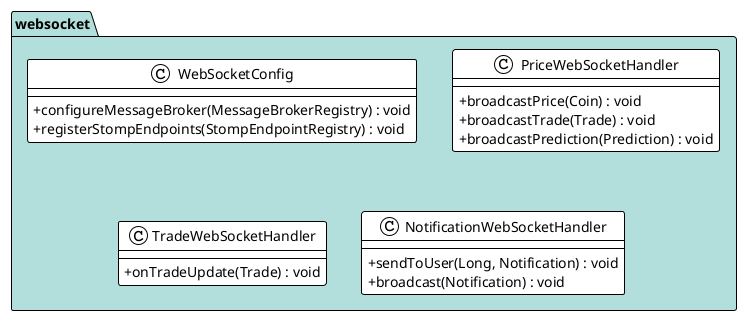

```plantuml
@startuml WebSocket
!theme plain
skinparam classAttributeIconSize 0

package "websocket" #B2DFDB {
  
  class WebSocketConfig {
    --
    + configureMessageBroker(MessageBrokerRegistry) : void
    + registerStompEndpoints(StompEndpointRegistry) : void
  }
  
  class PriceWebSocketHandler {
    --
    + broadcastPrice(Coin) : void
    + broadcastTrade(Trade) : void
    + broadcastPrediction(Prediction) : void
  }
  
  class TradeWebSocketHandler {
    --
    + onTradeUpdate(Trade) : void
  }
  
  class NotificationWebSocketHandler {
    --
    + sendToUser(Long, Notification) : void
    + broadcast(Notification) : void
  }
}

@enduml
```
